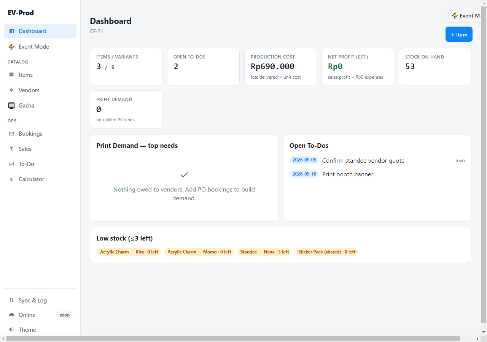
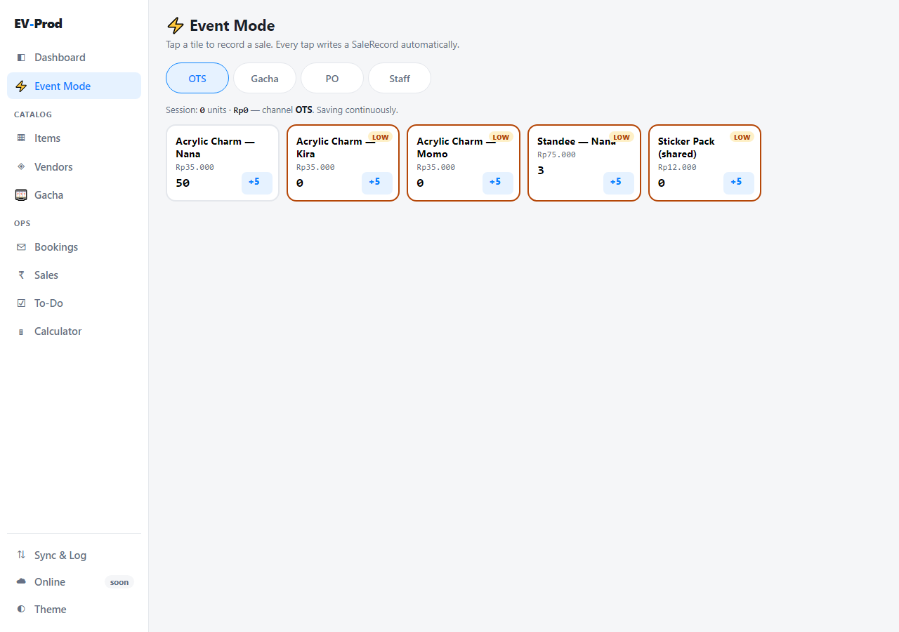
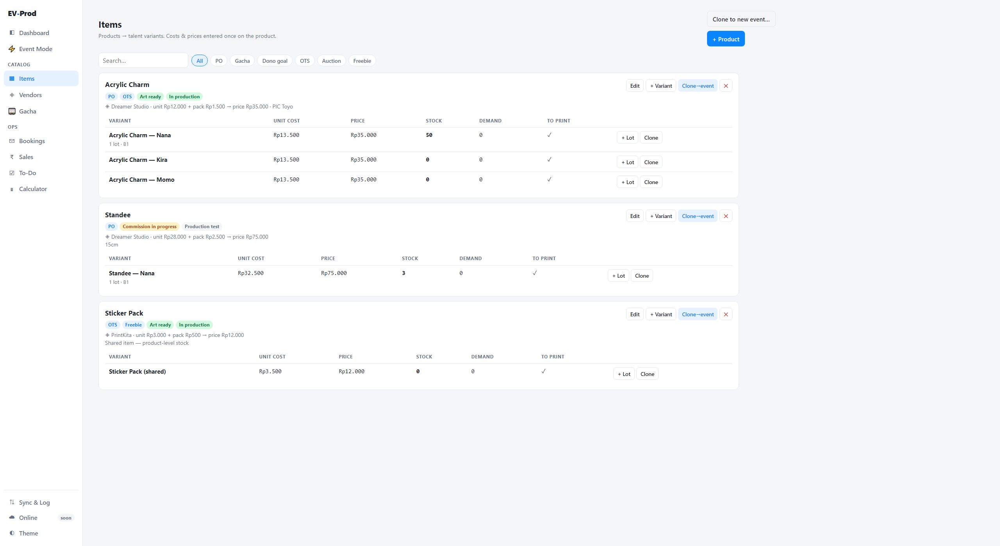
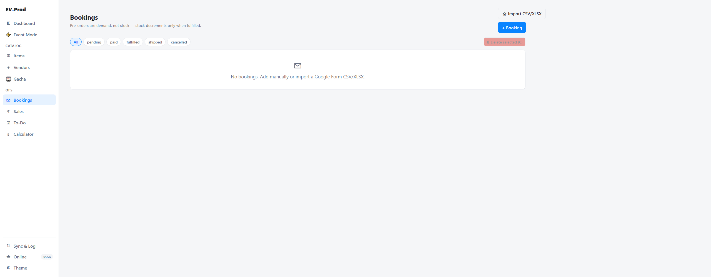
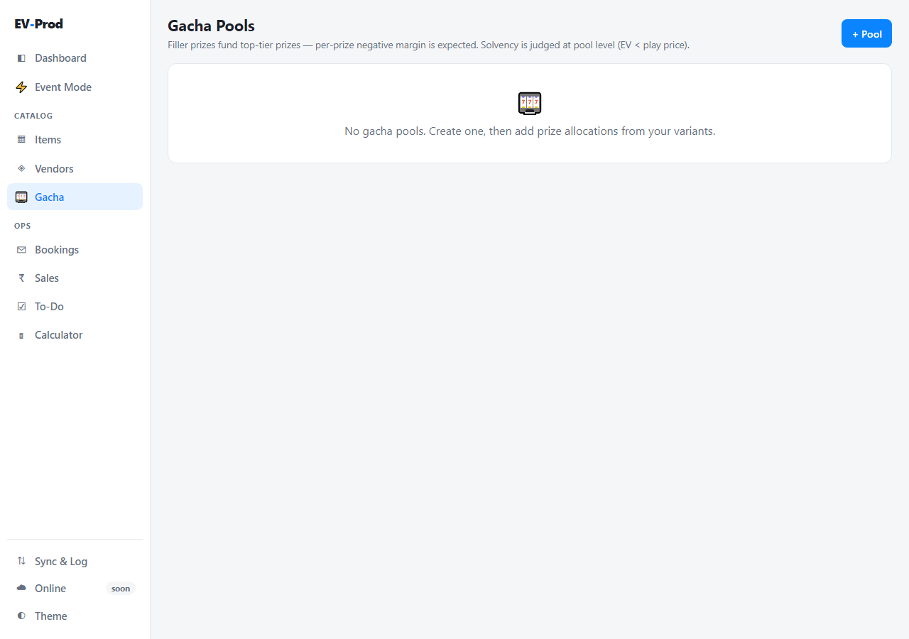
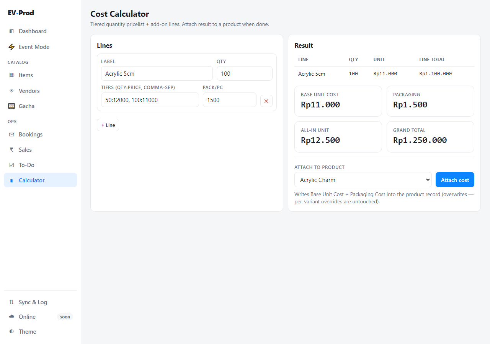

# EV-Prod — Event Production & Merch Stock Platform

> Offline-first ERP for managing an anime merchandise booth at events like [Comifuro](https://www.comifuro.net/) (Indonesia).
> Local Python server + disk persistence (`db.json`). No external internet required. Launch the server, run the event.

---

## What Is This?

EV-Prod replaces a sprawling Google Sheets workflow with a single self-contained web app. All event data lives in a persistent local `db.json` file managed by a lightweight Python backend (`server.py`), ensuring your data never disappears when switching browsers or clearing browser cache.

**Core problem it solves:** The previous Google Sheet had the same quantities and costs retyped across 4–5 tabs with inconsistent item names. One edit required manual updates in multiple places, and data drifted out of sync. EV-Prod enforces a single source of truth — every fact is entered exactly once; everything else is computed.

---

## Features

| Module | Description |
|--------|-------------|
| **Dashboard** | Summary cards (stock, cost, profit, print demand, open to-dos) + low-stock alerts |
| **Event Mode** ⚡ | Live booth tally: large touch tiles, tap = +1 sale, +5 batch button, channel toggle (OTS / Gacha / PO / Staff), amber badge on ≤3 remaining stock. Designed for one-handed phone use. |
| **Items** | Products → Talent Variants. Costs & prices entered once on the product, inherited by all variants. 1-click variant cloning. |
| **Talents** | Talent roster with P&L per talent (SKUs, produced, demand, sold, stock, revenue, net). |
| **Vendors** | Vendor list with contact links, linked from products. |
| **Gacha** | Gacha pool manager: prizes, drop rates, EV solvency check (warns when expected cost ≥ play price). Cross-subsidy model. |
| **Packaging** | Named pack kits with component lists and per-unit cost totals. |
| **Bookings** | Pre-order management: manual entry or CSV/XLSX import (Google Form export). Fuzzy item-name matching. Fulfillment types: booth pickup / mail order. Stock decrements only on fulfilled. |
| **Sales & Profit** | SaleRecord ledger: profit computed from `(price − unit cost) × qty` by channel. Never typed. |
| **Cost Calculator** | Tiered qty pricelist + add-on lines. Attach result directly to a product record. |
| **Sync & Log** | Export / import full JSON database. Merge-first import with diff preview. Auto-backup before any import. Restore last backup. Audit log of all mutations. Event switcher & archive. |

---

## Data Model

Eight core entities — every fact entered once:

```
Event
├── Product          (name, vendor, unit cost, pack cost, sell price, art/prod status, PIC)
│   └── TalentVariant  (inherits product defaults; per-variant cost/price overrides allowed)
│       ├── StockLot   (one production batch: qty ordered/delivered by source — PO/OTS/Gacha/Giveaway)
│       └── SaleRecord (qty sold, channel, unit price → profit computed)
├── GachaPool        (prizes linking to variants, drop rates, EV solvency check)
├── Booking          (customer PO: items × qty, payment stage, pickup or mail)
├── Vendor           (name, URL, notes)
└── Todo             (task, assignee, due date, done state)
```

**Key rule:** Bookings = demand (not stock). Stock only decrements when a booking is marked **fulfilled**.

---

## Architecture

```
Browser (UI & App Shell)
  ↕  fetch() JSON calls (GET/PUT /db)
Python Backend (server.py - Flask)
  ↕  Atomic write
db.json (Local disk database)
```

- **Single-file app**: all views are hash-routed panels inside `evprod.html`.
- **Storage**: a local disk JSON database (`db.json`) accessed via `http://localhost:5000/db`.
- **Multi-page pages**: `items.html`, `bookings.html`, `packaging.html`, `talents.html` are separate pages that share the same backend data — any change on one page is instantly saved to `db.json` and visible across all browsers.
- **No external internet required**: SheetJS is bundled offline; Python server runs entirely locally.

---

## Quickstart

### Windows
Double click `start.bat` (or run in terminal):
```bat
start.bat
```

### Mac / Linux
Run the launch script:
```sh
chmod +x start.sh
./start.sh
```

### Manual Run
```sh
python -m pip install -r requirements.txt
python server.py
```
Open **`http://localhost:5000`** in any modern browser.

> **Tip:** For venue use, your entire setup runs completely offline without Wi-Fi. Data is stored directly on your laptop disk in `db.json`.

---

## File Structure

```
ev-prod/
├── server.py                 ← Python Flask local backend (GET/PUT /db)
├── db.json                   ← Local database file on disk (auto-created)
├── requirements.txt          ← Python dependencies (Flask, flask-cors)
├── start.bat                 ← 1-click Windows launcher
├── start.sh                  ← 1-click Unix/Mac launcher
├── default.html              ← Entry point redirect → evprod.html
├── evprod.html               ← Main app (Dashboard, Event Mode, Vendors, Gacha, Sales, Todo, Calculator, Sync)
├── items.html                ← Items / Variants page
├── bookings.html             ← Bookings page
├── packaging.html            ← Packaging kits page
├── talents.html              ← Talents P&L page
│
├── assets/
│   ├── app.js                ← Application logic (store, UI, routing)
│   └── tokens.css            ← Design system tokens
│
├── vendor/
│   ├── tailadmin-build.css   ← Base CSS framework (pre-built)
│   └── xlsx.full.min.js      ← SheetJS (offline XLSX import)
│
├── docs/
│   └── prd-ev-prod-v1.md     ← Product Requirements Document v1
│
├── analysis/                 ← Research artifacts: CF-21 data, screenshots, Python scripts
│   ├── spec.json             ← Normalized data spec (CF-21)
│   ├── normalized.json       ← Normalized CF-21 data
│   ├── ev-prod-normalized-preview-v2.xlsx
│   ├── build_xlsx_v2.py      ← Script to build the preview workbook
│   ├── extract_cf21_v2.py    ← Script to extract/normalize CF-21 spreadsheet
│   └── shot-*.png            ← UI screenshots
│
├── tailadmin/                ← TailAdmin source (for rebuilding vendor CSS)
│
└── archive/                  ← Dated backups and experimental files (not active)
```

---

## Tech Stack

| Layer | Technology |
|-------|------------|
| Backend | Python 3 (Flask + flask-cors) |
| Local Storage | `db.json` on disk (atomic write) |
| UI Structure | HTML5 |
| Logic | Vanilla JavaScript (ES6+, strict mode) |
| Styling | Vanilla CSS + TailAdmin base |
| XLSX parsing | [SheetJS (xlsx)](https://sheetjs.com/) — bundled offline |

---

## Screenshots

> Screenshots taken during CF-21 post-event analysis and v1 development.

| | |
|---|---|
|  |  |
| **Dashboard** | **Event Mode** |
|  |  |
| **Dark Mode** | **Bookings** |
|  |  |
| **Gacha Pool** | **Cost Calculator** |

---

## Development Notes

### Backup Pattern
The user manually keeps dated HTML backups (`evprod.backup-YYYY-MM-DD.html`). Older backups live in `archive/`. The app itself auto-downloads timestamped JSON backups (`evprod-backup-YYYY-MM-DD-HHmm.json`) before any import.

### Data Migration
`app.js` includes a `migrate()` function that fills in any missing fields on load, ensuring older `localStorage` data continues to work as the schema evolves. The current schema version is `evprod.db.v1`.

### Multiple Events
The database supports multiple **Events** (e.g. CF-21, CF-23). All stock lots, sales, gacha pools, and bookings belong to an event. Past events become read-only archives.

---

## Roadmap

### v1 (current)
- [x] Offline-first, Python local server + db.json persistence
- [x] Products + Talent Variants
- [x] Event Mode live tally
- [x] Gacha pool with EV solvency check
- [x] Bookings with CSV/XLSX import
- [x] Cost calculator → attach to product
- [x] Audit log, export/import JSON, restore last backup
- [x] Light/dark theme

### v2 (planned)
- [ ] Online platform / server sync
- [ ] Multi-user login + attribution tracking
- [ ] Multi-device offline merge

### v3 (ideas)
- [ ] AI-assisted import column mapping
- [ ] Custom report builder

### Explicitly out of scope
- Dynamic QRIS / payment processing (use [BoothMate](https://boothmate.id/) for that)
- Per-member financial settlement
- Gacha pull mechanics / pull button

---

## License

Private project — not currently open source.
